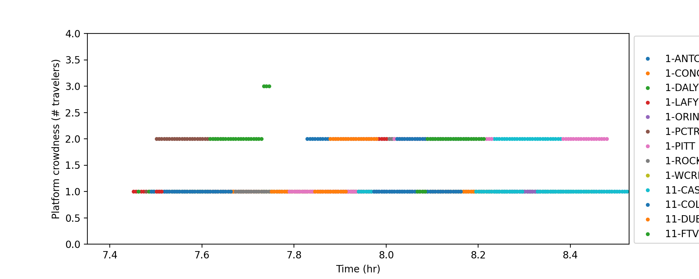
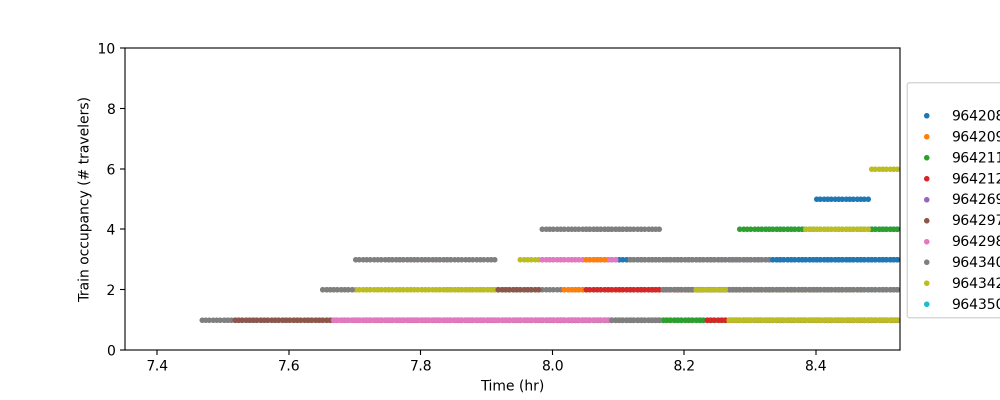

# Transit Sim

An agent-based simulator for city-scale transit usage prediction. It has a high temporal resolution (sub-minute to second) to capture the highly dynamic changes in platform crowding and train occupancy during the peak hours. It is capable of running the simulation for a whole city-scale network, all can be imported directly from GTFS and standard origin-destination data! See example notebooks below for more information.

### Simulator

### Visualization

### Simulation logic

### Output

The code outputs numbers of people waiting at each platform/stop and numbers of people on each train/bus, at a user specified time step (e.g., 20 seconds). Many visualizations can be generated, such as the platform crowding level and train occupancy level plots. These results facilitate the analysis of policy scenarios, e.g., fare policies, on relieving over-crowded platforms or trains.

