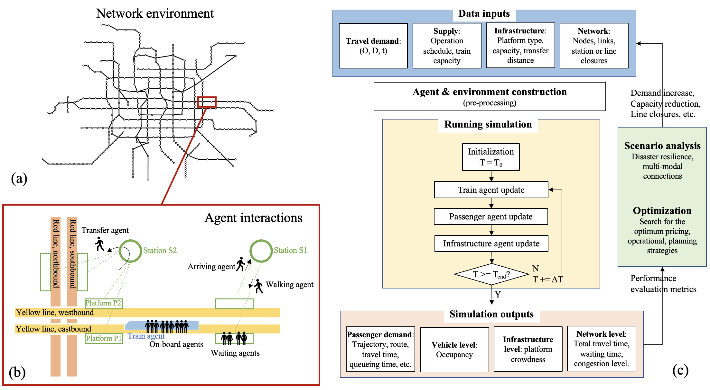

# Integrated Data-driven Agent-based Simulator (AAA-M)

An agent-based simulator for city-scale transit usage prediction. It has a high temporal resolution (sub-minute to second) to capture the highly dynamic changes in platform crowding and train occupancy during the peak hours. It is capable of running the simulation for a whole city-scale network, all can be imported directly from GTFS and standard origin-destination data!

### Features
The overall simulation logic is shown in the figure below:

Some highlights of the simulator include:
* Working seamlessly with GTFS inputs, which is available for many transit operators in the world;
    - Network inputs can be easily modified to reflect changes in infrastructure (e.g., station closures due to natural disasters).
* Agent-based framework can capture behavior dynamics for individual travelers, trains, and platforms (e.g., platform crowdness in the morning peak);
    - Traveler-level inputs and the resulting activity patterns can be compared to smartcard data to deepen the understanding of key operational parameters (e.g., train capacity).
* Simple tabulated OD structure facilitating the test of demand-side strategies;
    - Generate random OD files (if you are unsure about the demand during the testing phase).
* Fast speed: providing opportunities for optimization-based decision support.

### Preparing data inputs
AAA-M requires two major types of inputs: the network supply and the travel demand.

* For the supply-side information, the supported formats are the [GTFS](https://gtfs.org) transit feed. This data is available for lots of transit operators in the world, which can either be downloaded from their websites, or through online databases such as [Transitland](https://www.transit.land/map).
    - Specifically, AAA-M only requires three files in GTFS, `stops.txt`, `stop_times.txt`, and `trips.txt`. With these three files, AAA-M can automatically build the network environment, the infrastructure agents, and the service run agents, as shown in the simulation logic above.

* For the travel demand information, it can be hard to source, given many cities don't even own electronic records of detailed subway usage. Usually, three solutions are suggested, and the external data can be used as long as they are formulated as shown in the [example OD file](working_example_beijing_subway/inputs/beijing_line6_od.csv):
    - The best quality data would be from smartcard tap-in, tap-out data.
    - Other potential OD data sources are from travel surveys, or travel demand model outputs.
    - If none of the above are available, AAA-M provides the functionality to generate random ODs for preliminary analysis by calling `travelers.random_od(num_travelers=1000)`.

Additionally, smartcard tap-in, tap-out data can also be included (if available) for simulation verification.

### Running the simulator
There are in general two ways of running the simulator: locally or on convenient Jupyter Notebook platforms such as Google Colab.

##### Running AAA-M locally
* Preparation
    * AAA-M is coded in Python 3.7 and above. It is recommended to [install conda](https://docs.conda.io/projects/conda/en/latest/user-guide/install/index.html) and [create a dedicated virtual environment](https://docs.conda.io/projects/conda/en/latest/user-guide/tasks/manage-environments.html).
    * The default Dijkstra routing algorithm relies on [sp](https://github.com/cb-cities/sp). Follow the instructions on that page to compile the program.
    * Install [geopandas](https://geopandas.org/en/stable/) for geometry manipulation: `conda install -c conda-forge geopandas`

* An example notebook to run the simulation is provided in [transit_sim/transit_sim.ipynb](transit_sim/transit_sim.ipynb). You will need to modify it based on your inputs and run it cell by cell. Or you can refer to [the Beijing subway case study](working_example_beijing_subway) for a working example.
* An example notebook to run the simulation is provided in [transit_sim/transit_viz.ipynb](transit_sim/transit_viz.ipynb). You will need to modify it based on your inputs and run it cell by cell. Or you can refer to [the Beijing subway case study](working_example_beijing_subway) for a working example.

##### Running AAA-M on Google Colab
If you choose to run AAA-M on Google Colab, you don't need to install anything. Just go to the links below and run the notebook. Remember to Skip Step 0(A) as it is for running the code locally:
* Modify and run the simulation ](https://colab.research.google.com/github/cb-cities/transit_sim/blob/TRB/transit_sim.ipynb). Or you can refer to [the Beijing subway case study](working_example_beijing_subway) for a working example.
* Modify and show the visualization ](https://colab.research.google.com/github/cb-cities/transit_sim/blob/TRB/transit_viz.ipynb). Or you can refer to [the Beijing subway case study](working_example_beijing_subway) for a working example.

### Output

The code outputs numbers of people waiting at each platform/stop and numbers of people on each train/bus, at a user specified time step (e.g., 20 seconds). Many visualizations can be generated, such as the platform crowding level and train occupancy level plots. These results facilitate the analysis of policy scenarios, e.g., fare policies, on relieving over-crowded platforms or trains.

Individual traveler level (showing trajectories): 

Platform level (showing crowdness):

Service run level (showing occupancy):

System level (showing all train trajectories):

Calibration (parameter tuning through comparing a series of simulations against the observation data):
