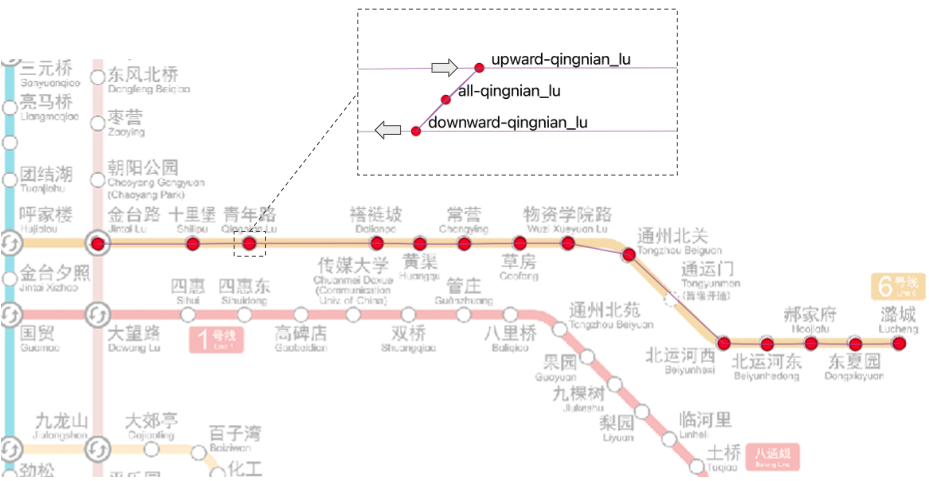
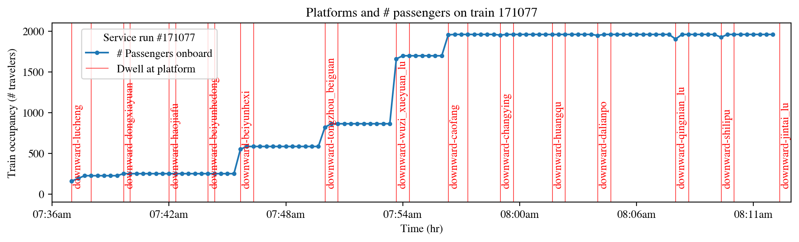
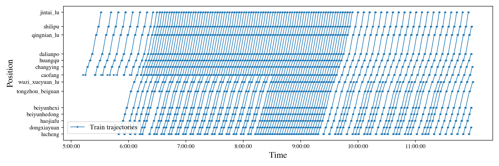

# A working example of AAA-M
-----

Simulating train movements, traveler locations, and platform crowdness for the east sections of Line 6 in Beijing Subway.



### Folder structure
```
.
+--- transit_sim_beijing_line6.ipynb: code to run the simulation
+--- transit_viz_beijing_line6.ipynb: code to visualize the simulation outputs
+--- inputs: inputs for the simulation, including the supply side (GTFS) and travel demand (OD) side inputs
|    +--- gtfs_line6_stops.csv: GTFS stops.txt file for the study area
|    +--- gtfs_line6_stop_times.csv: GTFS stop_times.txt file for the study area
|    +--- gtfs_line6_trips.csv: GTFS trips.txt file for the study area
|    +--- beijing_line6_od.csv: morning peak OD for a typical day
+--- outputs: outputs for the simulation, including train-leve, traveler-level, and system-level outputs
|    +--- train_outputs: time-stampped train status and occupancy
|    +--- traveler_outputs: time_stampped aggregated or individual traveler status (e.g., # passengers waiting at a platform)
|    +--- beijing_line6_nodes: node file for the study area
|    +--- beijing_line6_links: link file for the study area
|    +--- beijing_line6_schedule: train schedule for the study area

```

### Running the simulation
* Install the required python packages as introduced in [the README file](../README.md) of the root directory of the folder.
* Run cell by cell through the [transit_sim/transit_sim_beijing_line6.ipynb](transit_sim/transit_sim_beijing_line6.ipynb) using Jupyter Notebook. Customize if needed, e.g., adjusting train capacity or supply new travel demand files.
* Generate visualizations using the [transit_sim/transit_viz_beijing_line6.ipynb](transit_sim/transit_viz_beijing_line6.ipynb) using Jupyter Notebook. Customize if needed, e.g., to plot the train occupancy for a specific service run.

### Example outputs




